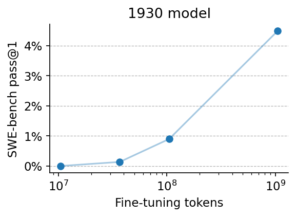
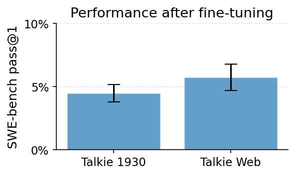

# From 1930 to SWE-bench

[ Models and training data](https://huggingface.co/collections/ricdomolm/1930-coder)

We fine-tune Alec Radford's 1930 vintage LLM — pre-trained only on
pre-1931 data — to solve SWE-bench issues. 

After just 250 training
examples the model lands [its first fix](https://htmlpreview.github.io/?https://github.com/RicardoDominguez/talkie-coder/blob/main/analysis/pydata__xarray-4629.traj.html) (a small patch to xarray);
scaled to ~75K trajectories (1B tokens), it reaches **4.5% pass@1** on
SWE-bench-Verified, up from 4% pass@100 on HumanEval at the base. 

The
sibling web-pretrained model gets to 5.5% pass@1 on the same recipe —
surprisingly little seems to be lost by throwing away the internet.

If you have more compute to spare, we'd love to see the full scaling
curves comparing the 1930 and web-pretrained models as post-training is scaled up.

This repo contains the SFT recipes, eval pipeline, and analysis for
fine-tuning `talkie-lm/talkie-1930-13b` and `talkie-lm/talkie-web-13b`
on SWE-bench-style agent trajectories.

<p align="center">
  
  
</p>

## Results

1. **2e-5 SFT on talkie-1930 base** — 12 h FSDPv2 run on 8×B200 over a
   100 K-trajectory SWE dataset, 2016 steps at 64 K context, lr=2e-5
   cosine. ckpt-2000 reaches **4.48 % pass@1** on a 446-instance
   SWE-bench-Verified-Working-Harbor subset (5x mean, σ=0.69 pp).
   See [`sft/run_swe_sft_12h_v2_lr2e5.sh`](sft/run_swe_sft_12h_v2_lr2e5.sh).

2. **2e-5 SFT on talkie-web base** — sibling run on the
   FineWeb-pretrained talkie-web variant, same recipe, same data
   (re-tokenized with the talkie-web BPE). ckpt-2000 reaches
   **5.75 % pass@1** (3x mean, σ=1.04 pp). See
   [`sft/run_swe_sft_12h_web_v2_lr2e5.sh`](sft/run_swe_sft_12h_web_v2_lr2e5.sh).

3. **Few-data fine-tuning sweep** — minimum-unique-data scan on the
   talkie-1930-it (instruct) checkpoint over a verified-trajectory
   subset of `ricdomolm/mini-coder-trajs-400k`. 5 runs vary unique-example
   count and epochs; pass@1 is graded on a 42-instance union subset.
   Launcher: [`sft/run_minimal_sft.sh`](sft/run_minimal_sft.sh).

The plots, pass@1 numbers, and the code that reduces the eval JSONs are
in [`analysis/plots.ipynb`](analysis/plots.ipynb).

## Layout

```
sft/                                       training entrypoint, modeling, data prep
  ft_trl.py                                trainer (TRL SFTTrainer + chat-token wd-skip)
  modeling_talkie.py                       Liger-CE + varlen + GC + ALL_ATTENTION_FUNCTIONS dispatch (vLLM-compat)
  configuration_talkie.py
  accelerate_config_talkie.yaml            FSDPv2, 8 ranks, FULL_STATE_DICT
  convert_base_to_hf.py                    talkie-1930 base.ckpt → HF safetensors
  convert_web_base_to_hf.py                talkie-web base.ckpt → HF safetensors
  build_talkie_web_tokenizer.py            tiktoken vocab.txt → HF tokenizer.json
  reinit_chat_tokens.py                    talkie-1930 chat-token row reinit
  reinit_chat_tokens_web.py                talkie-web chat-token row reinit
  repackage_for_vllm.py                    bake lm_head_gain → lm_head.weight for vLLM serving
  tokenize_messages.py                     per-shard chat-formatted tokenization
  jobs_tokenize.py                         HTCondor distributed launcher (250 jobs)
  latest_trl.sh                            env activation wrapper for HTCondor
  verify_tokenization.py                   spot-check a packed shard
  check_chat_token_norms.py                inspect embed/lm_head norms
  make_swe_100k_jsonl.py                   subsample final-400k → 100K JSONL
  make_mini_coder_verified_max3_jsonl.py   verified subset, ≤3 trajs/instance
  make_mini_coder_mix_max3_jsonl.py        verified + length-targeted unverified mix
  run_swe_sft_12h_v2_lr2e5.sh              ★ result 1: 2e-5 base SFT
  run_swe_sft_12h_web_v2_lr2e5.sh          ★ result 2: 2e-5 web SFT
  run_minimal_sft.sh                       ★ result 3: few-data sweep launcher
  CHAT_TOKEN_COLLAPSE.md                   diagnostic for the chat-token weight-decay bug
  CHAT_TOKEN_COLLAPSE_FIX.md               the wd-skip + reinit fix

eval/                                      SWE-bench eval pipeline (vLLM + mini-swe-agent + harness)
  README.md                                end-to-end eval recipe (read this first)
  docker_setup.sh                          rootless-docker startup
  localconfig_qwen3_train_aligned.yaml     mini-swe-agent eval config (matches training prompts)
  transfer_config.sh                       inject api_base + sampling into the eval config
  launch_parallel_eval.sh                  fan-out HTCondor submit (n_jobs × instances)
  run_mini_subjob.sh                       per-job entry (sets OUTPUT_DIR + slice)
  run_mini_eval.sh                         per-job: vLLM serve + mini-extra swebench + tmpfs drain
  run_grade.py                             swebench harness wrapper (resolved/unresolved breakdown)
  run_grade_wrapper.sh                     condor wrapper around run_grade.py
  grade_ckpt400.sub                        reference grade-job condor submit file
  launch_pass5_subset.sh                   fan out N×eval-runs against a fixed instance subset (variance reduction)
  grade_pass5.sh                           grade all pass-N runs in one shot
  pass5_watcher.py                         watcher that auto-restarts stuck pass-N runs
  post_sft_pipeline.sh                     end-to-end: repackage → eval → grade
  summarize_sweep.py                       reduce graded reports to sweep_summary.json
  multiple_evals.md                        usage notes for variance-reduced pass@1

analysis/
  plots_issue7.ipynb                       loads eval JSONs, builds the 2 plots
  sweep_summary.json                       few-data sweep aggregate
  swe_bench_eval_union42.json              42-instance union subset
  talkie-1930-v2-lr2e5-ckpt2000-pass5-run{1..5}.json   5x graded eval, 1930
  talkie-web-v2-lr2e5-ckpt2000-pass3-run{1..3}.json    3x graded eval, web
  plot1_pass1_vs_examples.png
  plot1_pass1_vs_steps.png
  plot2_web_vs_1930.png
```

## Pipelines

The three runs share the same shape: build base model on `/fast`,
build dataset JSONL, distributed-tokenize at 64 K, launch SFT.

**1. talkie-1930 2e-5 SFT**

```bash
# 1. Build the HF base model from talkie-lm/talkie-1930-13b base.ckpt + vocab.
#    (downloads handled outside the repo; convert_base_to_hf.py reads from
#    /tmp/talkie-1930-13b-base/, writes to /fast/rolmedo/models/talkie-1930-13b-base/.)
python sft/convert_base_to_hf.py
python sft/reinit_chat_tokens.py        # clone <|endoftext|> row into the 4 chat-token rows

# 2. Subsample the 100K SWE trajectories.
python sft/make_swe_100k_jsonl.py

# 3. Tokenize at 64K (250 HTCondor shards).
cd sft && python jobs_tokenize.py        # writes /fast/.../talkie-1930-swe-100k-64k/job_{0..249}/

# 4. Train.
bash sft/run_swe_sft_12h_v2_lr2e5.sh     # 2016 steps × ~20s/step ≈ 12h on 8×B200
```

**2. talkie-web 2e-5 SFT**

```bash
# 1. Build talkie-web tokenizer from vocab.txt, then HF base model.
python sft/build_talkie_web_tokenizer.py
python sft/convert_web_base_to_hf.py
python sft/reinit_chat_tokens_web.py     # writes -reinit/ side-by-side

# 2. Re-tokenize the same SWE-100K JSONL with the talkie-web BPE.
#    Edit jobs_tokenize.py to point at the talkie-web tokenizer dir, then:
cd sft && python jobs_tokenize.py

# 3. Train.
bash sft/run_swe_sft_12h_web_v2_lr2e5.sh
```

**3. Few-data sweep (5 runs)**

```bash
# 1. Build the verified mini-coder JSONL (≤3 trajs per instance_id).
python sft/make_mini_coder_verified_max3_jsonl.py
# Optional: build the verified+unverified mix variant.
python sft/make_mini_coder_mix_max3_jsonl.py

# 2. Tokenize for talkie-1930-it (similar to above but pointed at the
#    mini-coder JSONL and the talkie-1930-13b-it tokenizer).

# 3. Run each sweep point. run_minimal_sft.sh takes 4 args:
#    max_steps, subsample-fraction, run-name, output-dir.
bash sft/run_minimal_sft.sh  20 0.0047 talkie-1930-it-coder-s20-e3   /fast/.../talkie-1930-it-coder-s20-e3
bash sft/run_minimal_sft.sh  70 0.0136 talkie-1930-it-coder-s70-e3   /fast/.../talkie-1930-it-coder-s70-e3
bash sft/run_minimal_sft.sh 200 0.0386 talkie-1930-it-coder-s200-e3  /fast/.../talkie-1930-it-coder-s200-e3
bash sft/run_minimal_sft.sh 251 0.1290 talkie-1930-it-coder-d251-e10 /fast/.../talkie-1930-it-coder-d251-e10
bash sft/run_minimal_sft.sh 881 0.4516 talkie-1930-it-coder-d881-e9  /fast/.../talkie-1930-it-coder-d881-e9
```

(`s20_e3` etc. = ~20 unique examples × 3 epochs; the trainer auto-loops
to fill `max_steps` once `subsample` data is consumed.)

## Models & data

These scripts read/write the author's cluster paths under `/fast/rolmedo/`.
You'll need to substitute your own. Required upstream artifacts:

- `talkie-lm/talkie-1930-13b` (base.ckpt + vocab; `convert_base_to_hf.py` packages them)
- `talkie-lm/talkie-web-13b` (same)
- `talkie-lm/talkie-1930-13b-it` (HF format; used by the few-data sweep)
- A SWE-trajectory JSONL (we used a 100K reservoir-sample of an internal
  `final-400k.jsonl` of SWE-smith mini-swe-agent trajectories; any
  `{"instance_id", "messages": [{"role", "content"}, ...]}` JSONL works)
- `ricdomolm/mini-coder-trajs-400k` (HF dataset, for the few-data sweep)

## Pipeline notes

A few decisions that aren't obvious from the configs:

- **`max_grad_norm=30` (not the default 1.0).** Talkie's per-layer scalar
  gain modules (`attn_gain.a_g`, `mlp_gain.a_g`, `embed_skip.a_g`)
  accumulate gradients over the entire (seq × hidden) activation tensor,
  so they dominate the global L2 norm — clipping at 1.0 silently kills
  training. The 2e-5 runs use 30 (10× v1's 100, tightened for the
  larger-lr chat-token grad spikes).
- **`average_tokens_across_devices=False`.** TRL's default of `True`
  produces 8× inflated loss/grad-norm numbers under our `**kwargs`
  forward signature.
- **Weight-decay skip on `embed.weight` and `lm_head`.**
  `ChatPreservingSFTTrainer` in `ft_trl.py` excludes these from wd.
  Under `--completion_only_loss`, chat-token rows (`<|user|>`,
  `<|assistant|>`, `<|system|>`) receive no useful gradient. With
  wd=0.1 their norms collapse from ~0.86 to ~0.12 and the model stops
  emitting `<|end|>`. Skipping wd on these breaks the loop.
- **Chat-token reinit** clones the `<|endoftext|>` row (id 65535) into
  the 4 chat-token rows (65536–65539) plus 1e-3 Gaussian noise.
  `convert_*_base_to_hf.py` mean-pads those rows; without the reinit
  the chat tokens collapse during SFT and inference produces nonsense.
- **64 K context with NTK-extended RoPE** (`rope_theta=4e7`,
  `max_position_embeddings=65536`) is set at convert time. Costs ~14 %
  on short evals (GSM8K) vs. the original `theta=1e6` — the right
  trade for long agent traces.
- **`save_pretrained` + FSDP wrap saves fp32 and copies torch source
  files into the output dir.** `ft_trl.py:final_save` bypasses this
  with explicit `safetensors.save_file` (bf16) and re-copies modeling
  + tokenizer files from the source dir.

## Eval

Pass@1 is graded by the [SWE-bench harness](https://github.com/SWE-bench/SWE-bench)
running [mini-swe-agent](https://github.com/SWE-bench/mini-swe-agent)
against the trained checkpoint, served by vLLM 0.19 (transformers backend).
The 446-instance set is `ricdomolm/SWE-bench_Verified-Working-Harbor`.

Pipeline (see [`eval/README.md`](eval/README.md) for the full
recipe with all the gotchas):

```bash
# 1. Bake lm_head_gain → lm_head.weight; copy refactored modeling; patch configs.
python sft/repackage_for_vllm.py --src <ckpt-dir> --dst <vllm-dir>
# (then sync modeling_talkie.py, set AutoModel auto_map, set <|end|> as eos)

# 2. Fan out per-instance eval over HTCondor (vLLM serves locally, mini-swe-agent drives).
cd eval
./launch_parallel_eval.sh <vllm-dir> <output-dir> <n_subjobs> <n_instances>

# 3. Merge per-sub-job preds.json, then grade.
python3 -c "..."   # see eval/README.md §4 for the merge snippet
condor_submit_bid 51 grade_ckpt400.sub   # or analogous, points at preds.merged.json

# Variance-reduced pass@1: launch N independent runs, then summarize.
./launch_pass5_subset.sh <vllm-dir> <output-dir-pattern> <subset-json> <N>
./grade_pass5.sh <output-dir-pattern>
python summarize_sweep.py <output-dir-pattern> > sweep_summary.json
```

The eval JSONs in `analysis/` are the harness's per-run reports
(`*-pass*-run*.json` containing `resolved_ids`); the notebook reduces
them to pass@1 means and bars.

Non-obvious eval-side decisions (full list in `eval/README.md`):

- **Greedy decoding is broken on talkie SFT.** `temperature=0` triggers
  catastrophic single-token loops (`sympsymp...`) on ~50 % of trajectories.
  Use `temperature=0.7`, `max_tokens=4096` per turn.
- **`repetition_penalty` hurts more than it helps** on long agent
  dialogues — penalizes the submission marker and code-syntax tokens.
- **`max-model-len=32768`, not 64K.** KV cache at 64K + 26 GB bf16 model
  exceeds H100's 80 GB.
- **fp8 is broken** on talkie (vLLM `--quantization fp8` and
  `--kv-cache-dtype fp8` both regress). Stick with bf16.
- **vLLM transformers backend** needs `lm_head_gain` baked into
  `lm_head.weight` (`repackage_for_vllm.py`) and the modeling refactored
  to dispatch attention through `ALL_ATTENTION_FUNCTIONS`. Both are
  already in this repo.
- **`<|end|>` as eos**, not `<|endoftext|>` — the model never emits the
  latter; the chat-token reinit teaches it to emit `<|end|>` at turn
  boundaries.
- **Salvage hook** in `mini-swe-agent`: when an instance ends in any
  non-`Submitted` state with a live container, run a final
  `git diff --cached` and use that as the patch. Recovers WIP edits
  that would otherwise be discarded as empty submissions.
